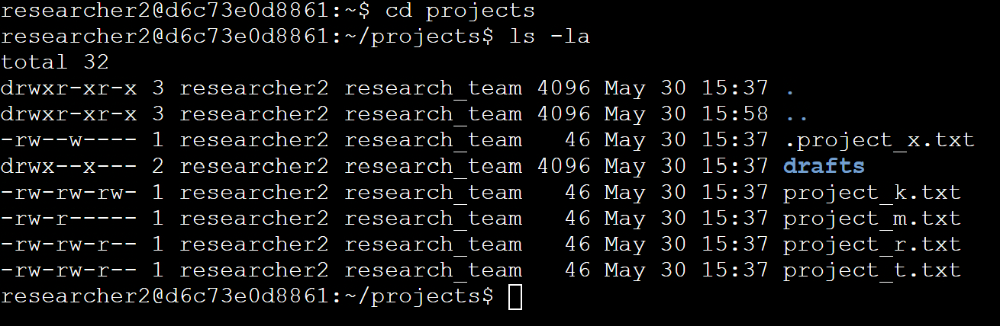
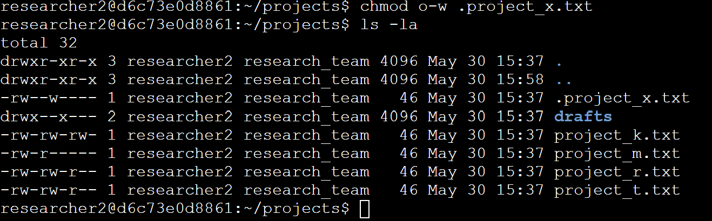
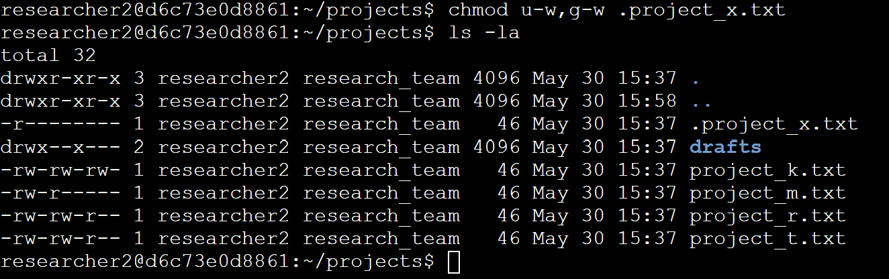
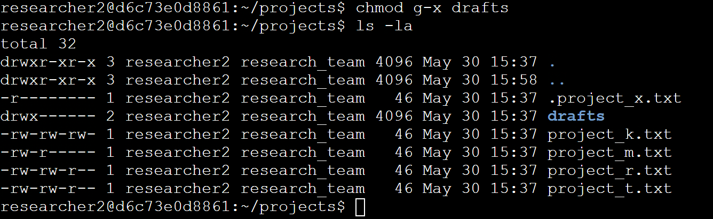

# File permissions in Linux

## Project description

Using bash shell, check the permissions for all files including hidden files. Remove the write access for the other users.  Change the permissions for the hidden file project_x.txt so no one can write to the file. Lastly, change the user permissions so only researcher2 has access to the drafts directory. 

## Check file and directory details

Using the ls command combined with -la we can see all files and directories (visible and hidden)  in our current directory along with all of the permissions granted to the user, group, and others. 

The user has read and write permissions on all files and directories, and only executable permissions on the drafts directory. The group has read permissions on all files except the hidden file .project_x.txt. The group has write permissions on project_k.txt, project_r.txt, project_t.txt, and hidden .project_x.txt. The group also has executable permissions on the drafts directory. Other users have read permissions for  project_k.txt, project_r.txt, and project_t.txt. Other users have write permissions on project_k.txt as well. 

## Describe the permissions string

The file permissions are laid out on the far left of the output in the 10-character string. For example, project_k.txt shows the string “-rw-rw-rw-.” This indicates that this is a file (the dash), the user has read and write permissions (rw-) the group has read and write permissions (rw-) and other users have read and write permissions (rw-). In this example we know that no one has executable permissions, as indicated by the dash at the end of each 3-character string.

## Change file permissions

The other use group has write permissions for the file project_k.txt. In all other cases, the other user group only has permissions read if any permissions at all. Using “chmod o-w project_k.txt”, we can remove the ability for the other group to write to project_k.txt. The same outcome can be achieved using “chmod o=r project_k.txt”.

## Change file permissions on a hidden file

Using ls -la we can see the permissions for all files including hidden files like .project_x.txt. To change the permissions of the file (in this case, removing write from the user and the group) we use the chmod command. Followed by [user group] +/- permission to be added or removed, and a comma separating each group. Double check the work using the ls -la command again. 

## Change directory permissions

Changing the permissions on a directory is the same as changing the permissions on a file. By using the chmod command we can remove the executable permissions from the group, ensuring that only researcher2 is able to access the directory. 

## Summary

In summary, we were able to change the permissions on files and directories using the chmod command and check our work using the ls command. Both require various changes to the arguments and options so that we are able to properly track all of the changes that were made.